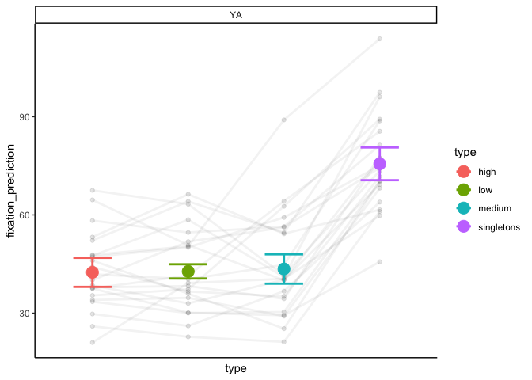
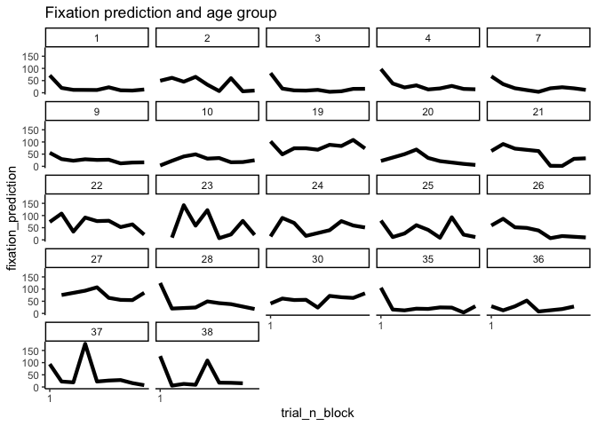
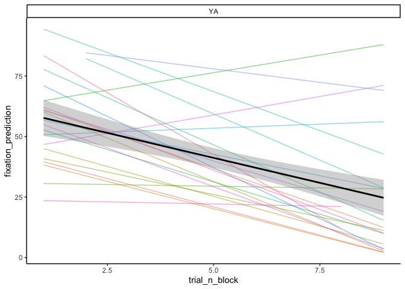
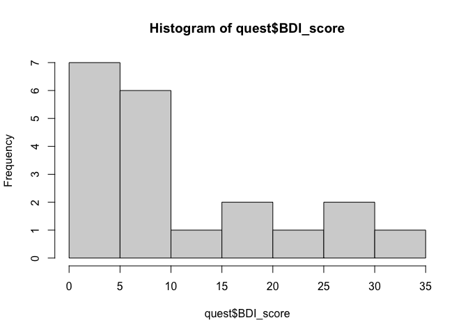
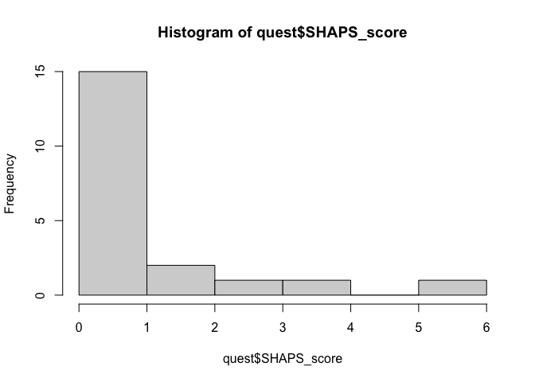
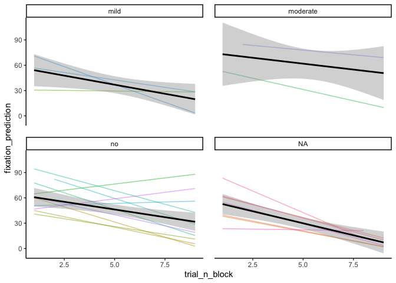

-   [Analysis of the Data for Isabel](#analysis-of-the-data-for-isabel)
    -   [Get the data](#get-the-data)
    -   [ET data](#et-data)
        -   [prediction](#prediction)
        -   [Learning for the first 10 trials, by
            participant](#learning-for-the-first-10-trials-by-participant)
        -   [Include the questionnaires](#include-the-questionnaires)
        -   [Plot the questionnaires by symptom
            severity](#plot-the-questionnaires-by-symptom-severity)
        -   [Analyze](#analyze)
        -   [Median Split](#median-split)

# Analysis of the Data for Isabel

Initialize packages and functions

## Get the data

``` r
#------------------------------------------------------------------------------#
# get the data from the two versions and merge them
#------------------------------------------------------------------------------#
ds<-list.files("data")

version1<-read.csv(paste0('data/',ds[1]))
version2<-read.csv(paste0('data/',ds[2]))

# since we have two "participants two", delete the second one
# also the number 50 (which is me)
version1<-version1[version1$participant!=50 ,]

version2<-version2[version2$participant!=02  ,]

# before merging, check the variables of interest
vars<-names(version2)[names(version2) %in% names(version1)]

# delete the first that is just a "x'
vars<-vars[-1]

# subset these variables in the two versions
version1<-version1[, vars]
version2<-version2[, vars]

# merge them 
data_all<-rbind(version1, version2)

# how many participants?
participants<-unique(data_all$participant)

# count them by age group
count<-data_all %>%
  group_by(participant, age_group) %>%
  tally()

# select only young adults
data_all<-data_all[data_all$age_group=="YA",]
```

## ET data

### prediction

``` r
#------------------------------------------------------------------------------#
# have a look at the et data- 

# select only participants for which we have the eyetracking  data
sum_et<-data_all %>%
  group_by(participant) %>%
  dplyr::summarise(et = mean(fixation_error, na.rm = T))

# which participants have the et data?
part_incl<-sum_et$participant[!is.na(sum_et$et)]
part_incl
```

    ##  [1]  1  2  3  4  7  9 10 19 20 21 22 23 24 25 26 27 28 30 35 36 37 38

``` r
# subset
all_data_et<-data_all[data_all$participant %in% part_incl,]

# plot prediction - distance between where they look at and the most likely location

# aggregated by trial type
dat_summary_fix_type<- summarySEwithin(all_data_et,
                                       measurevar = "fixation_prediction",
                                       withinvars = c("type" ), 
                                       betweenvars = "age_group",
                                       idvar = "participant", 
                                       na.rm = T)
```

    ## Automatically converting the following non-factors to factors: age_group, type

``` r
# plot
ggplot(all_data_et %>%
         group_by(participant,
                  type)%>%
         dplyr::summarise(fixation_prediction=mean(fixation_prediction, na.rm=T)), 
       aes(x = type, y = fixation_prediction, colour = type ))+
  geom_point(alpha = 0.10, colour = "black" )+
  geom_line( aes(type, fixation_prediction,group = participant),
             size=1, alpha=0.05, stat="summary" , colour = 'black')+
  theme(axis.text.x = element_blank())+ # we are showing the different levels through the colors, so we can avoid naming the bars
  geom_point(stat="summary", size = 5, data = dat_summary_fix_type)+
  
  geom_errorbar(aes( y = fixation_prediction, ymin = fixation_prediction - ci, 
                     ymax = fixation_prediction + ci),
                width = 0.40, size = 1,data=dat_summary_fix_type)+
  
  facet_wrap(.~age_group)+
  custom_param()+
  theme_classic()+
  theme(axis.text.x = element_blank(), 
        axis.ticks.x = element_blank()) 
```

    ## `summarise()` has grouped output by 'participant'. You can override using the
    ## `.groups` argument.

    ## Warning: Using `size` aesthetic for lines was deprecated in ggplot2 3.4.0.
    ## ℹ Please use `linewidth` instead.
    ## This warning is displayed once every 8 hours.
    ## Call `lifecycle::last_lifecycle_warnings()` to see where this warning was
    ## generated.

    ## No summary function supplied, defaulting to `mean_se()`

    ## No summary function supplied, defaulting to `mean_se()`



### Learning for the first 10 trials, by participant

``` r
# look at learning only from the first 10 trials
# by subject
ggplot(all_data_et[all_data_et$trial_n_block<10 & all_data_et$type!='singletons',], # we do not want the singletons
       aes(x = trial_n_block, y = fixation_prediction,
           #colour = age_group, 
           group = 1))+
  stat_summary(fun.y="mean",geom="line", size = 1.5)+
  #facet_wrap(participant~age_group)+
  facet_wrap(participant~.)+
  scale_x_continuous(breaks=seq(1, 100, 19))+
  scale_color_manual(values = c(c( "#AA4499" ,"#44AA99","#332288")))+
  theme_classic()+
  ggtitle("Fixation prediction and age group")
```

    ## Warning: The `fun.y` argument of `stat_summary()` is deprecated as of ggplot2 3.3.0.
    ## ℹ Please use the `fun` argument instead.
    ## This warning is displayed once every 8 hours.
    ## Call `lifecycle::last_lifecycle_warnings()` to see where this warning was
    ## generated.

    ## Warning: Removed 109 rows containing non-finite values (`stat_summary()`).


\### Learning for the first 10 trials: across participants

``` r
ggplot(all_data_et[all_data_et$trial_n_block<10,], aes( x=trial_n_block, y=fixation_prediction))+
  geom_line(stat="smooth",method = "lm", formula=y~x, alpha=0.5, se=F)+
  aes(colour = factor(participant))+
  geom_smooth(method="lm",formula=y~x, se=T, colour = "black" )+
  theme(strip.text.x = element_text(size = 13))+
  theme_classic()+
  theme(panel.spacing = unit(1, "lines"))+
  facet_wrap(.~age_group)+
  #ggtitle("Experiment 2")+
  theme(legend.position = "none")
```

    ## Warning: Removed 109 rows containing non-finite values (`stat_smooth()`).
    ## Removed 109 rows containing non-finite values (`stat_smooth()`).



### Include the questionnaires

``` r
# add the questionnaires
quest<-read.csv("Questionnaires.csv", sep = ";")

# check distribution of BDI and SHAPS
hist(quest$BDI_score)
```



``` r
hist(quest$SHAPS_score)
```



``` r
# attache the values to each participant
# relevant variables
rel_var<-c("BDI_score", "BDI_class", "SHAPS_score", "SHAPS_class")

# initialize them in the dataframe
for (var in rel_var){
  
  all_data_et[[var]]<-NA
  
}


for ( n in 1:nrow(all_data_et)){
  
  # get the scores for current participant
  curr_part<-quest[quest$ID == all_data_et$participant[n],]
  
  # if we have questionnaires data for that participant
  if (nrow(curr_part)>0 ){
  for (var in rel_var){
    
    all_data_et[[var]][n]<-curr_part[[var]]
    
  }
  }

}
```

### Plot the questionnaires by symptom severity

``` r
ggplot(all_data_et[all_data_et$trial_n_block<10,], aes( x=trial_n_block, y=fixation_prediction))+
  geom_line(stat="smooth",method = "lm", formula=y~x, alpha=0.5, se=F)+
  aes(colour = factor(participant))+
  geom_smooth(method="lm",formula=y~x, se=T, colour = "black" )+
  theme(strip.text.x = element_text(size = 13))+
  theme_classic()+
  theme(panel.spacing = unit(1, "lines"))+
  facet_wrap(.~BDI_class)+
  #ggtitle("Experiment 2")+
  theme(legend.position = "none")
```

    ## Warning: Removed 109 rows containing non-finite values (`stat_smooth()`).
    ## Removed 109 rows containing non-finite values (`stat_smooth()`).



### Analyze

``` r
# -----------------------------------------------------------------------------#
# center trial_n_block
all_data_et$trial_n_block_c<-scale(all_data_et$trial_n_block, center = T)

# analyze
mod_BDI<-lmer(fixation_prediction~BDI_score*trial_n_block_c +
                (1+trial_n_block_c|participant), 
              data=all_data_et[all_data_et$trial_n_block<10,])

tab_model(mod_BDI)
```

<table style="border-collapse:collapse; border:none;">
<tr>
<th style="border-top: double; text-align:center; font-style:normal; font-weight:bold; padding:0.2cm;  text-align:left; ">
 
</th>
<th colspan="3" style="border-top: double; text-align:center; font-style:normal; font-weight:bold; padding:0.2cm; ">
fixation_prediction
</th>
</tr>
<tr>
<td style=" text-align:center; border-bottom:1px solid; font-style:italic; font-weight:normal;  text-align:left; ">
Predictors
</td>
<td style=" text-align:center; border-bottom:1px solid; font-style:italic; font-weight:normal;  ">
Estimates
</td>
<td style=" text-align:center; border-bottom:1px solid; font-style:italic; font-weight:normal;  ">
CI
</td>
<td style=" text-align:center; border-bottom:1px solid; font-style:italic; font-weight:normal;  ">
p
</td>
</tr>
<tr>
<td style=" padding:0.2cm; text-align:left; vertical-align:top; text-align:left; ">
(Intercept)
</td>
<td style=" padding:0.2cm; text-align:left; vertical-align:top; text-align:center;  ">
-42.97
</td>
<td style=" padding:0.2cm; text-align:left; vertical-align:top; text-align:center;  ">
-132.00 – 46.06
</td>
<td style=" padding:0.2cm; text-align:left; vertical-align:top; text-align:center;  ">
0.343
</td>
</tr>
<tr>
<td style=" padding:0.2cm; text-align:left; vertical-align:top; text-align:left; ">
BDI score
</td>
<td style=" padding:0.2cm; text-align:left; vertical-align:top; text-align:center;  ">
-0.24
</td>
<td style=" padding:0.2cm; text-align:left; vertical-align:top; text-align:center;  ">
-7.69 – 7.21
</td>
<td style=" padding:0.2cm; text-align:left; vertical-align:top; text-align:center;  ">
0.950
</td>
</tr>
<tr>
<td style=" padding:0.2cm; text-align:left; vertical-align:top; text-align:left; ">
trial n block c
</td>
<td style=" padding:0.2cm; text-align:left; vertical-align:top; text-align:center;  ">
-61.07
</td>
<td style=" padding:0.2cm; text-align:left; vertical-align:top; text-align:center;  ">
-115.66 – -6.49
</td>
<td style=" padding:0.2cm; text-align:left; vertical-align:top; text-align:center;  ">
<strong>0.028</strong>
</td>
</tr>
<tr>
<td style=" padding:0.2cm; text-align:left; vertical-align:top; text-align:left; ">
BDI score \* trial n block<br>c
</td>
<td style=" padding:0.2cm; text-align:left; vertical-align:top; text-align:center;  ">
-0.02
</td>
<td style=" padding:0.2cm; text-align:left; vertical-align:top; text-align:center;  ">
-4.67 – 4.63
</td>
<td style=" padding:0.2cm; text-align:left; vertical-align:top; text-align:center;  ">
0.992
</td>
</tr>
<tr>
<td colspan="4" style="font-weight:bold; text-align:left; padding-top:.8em;">
Random Effects
</td>
</tr>
<tr>
<td style=" padding:0.2cm; text-align:left; vertical-align:top; text-align:left; padding-top:0.1cm; padding-bottom:0.1cm;">
σ<sup>2</sup>
</td>
<td style=" padding:0.2cm; text-align:left; vertical-align:top; padding-top:0.1cm; padding-bottom:0.1cm; text-align:left;" colspan="3">
1725.28
</td>
</tr>
<tr>
<td style=" padding:0.2cm; text-align:left; vertical-align:top; text-align:left; padding-top:0.1cm; padding-bottom:0.1cm;">
τ<sub>00</sub> <sub>participant</sub>
</td>
<td style=" padding:0.2cm; text-align:left; vertical-align:top; padding-top:0.1cm; padding-bottom:0.1cm; text-align:left;" colspan="3">
3608.69
</td>
<tr>
<td style=" padding:0.2cm; text-align:left; vertical-align:top; text-align:left; padding-top:0.1cm; padding-bottom:0.1cm;">
τ<sub>11</sub> <sub>participant.trial_n_block_c</sub>
</td>
<td style=" padding:0.2cm; text-align:left; vertical-align:top; padding-top:0.1cm; padding-bottom:0.1cm; text-align:left;" colspan="3">
850.25
</td>
<tr>
<td style=" padding:0.2cm; text-align:left; vertical-align:top; text-align:left; padding-top:0.1cm; padding-bottom:0.1cm;">
ρ<sub>01</sub> <sub>participant</sub>
</td>
<td style=" padding:0.2cm; text-align:left; vertical-align:top; padding-top:0.1cm; padding-bottom:0.1cm; text-align:left;" colspan="3">
1.00
</td>
<tr>
<td style=" padding:0.2cm; text-align:left; vertical-align:top; text-align:left; padding-top:0.1cm; padding-bottom:0.1cm;">
ICC
</td>
<td style=" padding:0.2cm; text-align:left; vertical-align:top; padding-top:0.1cm; padding-bottom:0.1cm; text-align:left;" colspan="3">
0.14
</td>
<tr>
<td style=" padding:0.2cm; text-align:left; vertical-align:top; text-align:left; padding-top:0.1cm; padding-bottom:0.1cm;">
N <sub>participant</sub>
</td>
<td style=" padding:0.2cm; text-align:left; vertical-align:top; padding-top:0.1cm; padding-bottom:0.1cm; text-align:left;" colspan="3">
15
</td>
<tr>
<td style=" padding:0.2cm; text-align:left; vertical-align:top; text-align:left; padding-top:0.1cm; padding-bottom:0.1cm; border-top:1px solid;">
Observations
</td>
<td style=" padding:0.2cm; text-align:left; vertical-align:top; padding-top:0.1cm; padding-bottom:0.1cm; text-align:left; border-top:1px solid;" colspan="3">
316
</td>
</tr>
<tr>
<td style=" padding:0.2cm; text-align:left; vertical-align:top; text-align:left; padding-top:0.1cm; padding-bottom:0.1cm;">
Marginal R<sup>2</sup> / Conditional R<sup>2</sup>
</td>
<td style=" padding:0.2cm; text-align:left; vertical-align:top; padding-top:0.1cm; padding-bottom:0.1cm; text-align:left;" colspan="3">
0.045 / 0.183
</td>
</tr>
</table>

``` r
# mod shaps
mod_SHAPS<-lmer(fixation_prediction~SHAPS_score*trial_n_block_c +
                (1+trial_n_block_c|participant), 
              data=all_data_et[all_data_et$trial_n_block<10,])
```

    ## boundary (singular) fit: see help('isSingular')

``` r
tab_model(mod_SHAPS)
```

<table style="border-collapse:collapse; border:none;">
<tr>
<th style="border-top: double; text-align:center; font-style:normal; font-weight:bold; padding:0.2cm;  text-align:left; ">
 
</th>
<th colspan="3" style="border-top: double; text-align:center; font-style:normal; font-weight:bold; padding:0.2cm; ">
fixation_prediction
</th>
</tr>
<tr>
<td style=" text-align:center; border-bottom:1px solid; font-style:italic; font-weight:normal;  text-align:left; ">
Predictors
</td>
<td style=" text-align:center; border-bottom:1px solid; font-style:italic; font-weight:normal;  ">
Estimates
</td>
<td style=" text-align:center; border-bottom:1px solid; font-style:italic; font-weight:normal;  ">
CI
</td>
<td style=" text-align:center; border-bottom:1px solid; font-style:italic; font-weight:normal;  ">
p
</td>
</tr>
<tr>
<td style=" padding:0.2cm; text-align:left; vertical-align:top; text-align:left; ">
(Intercept)
</td>
<td style=" padding:0.2cm; text-align:left; vertical-align:top; text-align:center;  ">
-54.48
</td>
<td style=" padding:0.2cm; text-align:left; vertical-align:top; text-align:center;  ">
-118.56 – 9.60
</td>
<td style=" padding:0.2cm; text-align:left; vertical-align:top; text-align:center;  ">
0.095
</td>
</tr>
<tr>
<td style=" padding:0.2cm; text-align:left; vertical-align:top; text-align:left; ">
SHAPS score
</td>
<td style=" padding:0.2cm; text-align:left; vertical-align:top; text-align:center;  ">
8.55
</td>
<td style=" padding:0.2cm; text-align:left; vertical-align:top; text-align:center;  ">
-37.35 – 54.44
</td>
<td style=" padding:0.2cm; text-align:left; vertical-align:top; text-align:center;  ">
0.714
</td>
</tr>
<tr>
<td style=" padding:0.2cm; text-align:left; vertical-align:top; text-align:left; ">
trial n block c
</td>
<td style=" padding:0.2cm; text-align:left; vertical-align:top; text-align:center;  ">
-64.65
</td>
<td style=" padding:0.2cm; text-align:left; vertical-align:top; text-align:center;  ">
-103.89 – -25.40
</td>
<td style=" padding:0.2cm; text-align:left; vertical-align:top; text-align:center;  ">
<strong>0.001</strong>
</td>
</tr>
<tr>
<td style=" padding:0.2cm; text-align:left; vertical-align:top; text-align:left; ">
SHAPS score \* trial n<br>block c
</td>
<td style=" padding:0.2cm; text-align:left; vertical-align:top; text-align:center;  ">
2.41
</td>
<td style=" padding:0.2cm; text-align:left; vertical-align:top; text-align:center;  ">
-26.19 – 31.01
</td>
<td style=" padding:0.2cm; text-align:left; vertical-align:top; text-align:center;  ">
0.868
</td>
</tr>
<tr>
<td colspan="4" style="font-weight:bold; text-align:left; padding-top:.8em;">
Random Effects
</td>
</tr>
<tr>
<td style=" padding:0.2cm; text-align:left; vertical-align:top; text-align:left; padding-top:0.1cm; padding-bottom:0.1cm;">
σ<sup>2</sup>
</td>
<td style=" padding:0.2cm; text-align:left; vertical-align:top; padding-top:0.1cm; padding-bottom:0.1cm; text-align:left;" colspan="3">
1725.17
</td>
</tr>
<tr>
<td style=" padding:0.2cm; text-align:left; vertical-align:top; text-align:left; padding-top:0.1cm; padding-bottom:0.1cm;">
τ<sub>00</sub> <sub>participant</sub>
</td>
<td style=" padding:0.2cm; text-align:left; vertical-align:top; padding-top:0.1cm; padding-bottom:0.1cm; text-align:left;" colspan="3">
3556.99
</td>
<tr>
<td style=" padding:0.2cm; text-align:left; vertical-align:top; text-align:left; padding-top:0.1cm; padding-bottom:0.1cm;">
τ<sub>11</sub> <sub>participant.trial_n_block_c</sub>
</td>
<td style=" padding:0.2cm; text-align:left; vertical-align:top; padding-top:0.1cm; padding-bottom:0.1cm; text-align:left;" colspan="3">
885.79
</td>
<tr>
<td style=" padding:0.2cm; text-align:left; vertical-align:top; text-align:left; padding-top:0.1cm; padding-bottom:0.1cm;">
ρ<sub>01</sub> <sub>participant</sub>
</td>
<td style=" padding:0.2cm; text-align:left; vertical-align:top; padding-top:0.1cm; padding-bottom:0.1cm; text-align:left;" colspan="3">
1.00
</td>
<tr>
<td style=" padding:0.2cm; text-align:left; vertical-align:top; text-align:left; padding-top:0.1cm; padding-bottom:0.1cm;">
N <sub>participant</sub>
</td>
<td style=" padding:0.2cm; text-align:left; vertical-align:top; padding-top:0.1cm; padding-bottom:0.1cm; text-align:left;" colspan="3">
15
</td>
<tr>
<td style=" padding:0.2cm; text-align:left; vertical-align:top; text-align:left; padding-top:0.1cm; padding-bottom:0.1cm; border-top:1px solid;">
Observations
</td>
<td style=" padding:0.2cm; text-align:left; vertical-align:top; padding-top:0.1cm; padding-bottom:0.1cm; text-align:left; border-top:1px solid;" colspan="3">
316
</td>
</tr>
<tr>
<td style=" padding:0.2cm; text-align:left; vertical-align:top; text-align:left; padding-top:0.1cm; padding-bottom:0.1cm;">
Marginal R<sup>2</sup> / Conditional R<sup>2</sup>
</td>
<td style=" padding:0.2cm; text-align:left; vertical-align:top; padding-top:0.1cm; padding-bottom:0.1cm; text-align:left;" colspan="3">
0.068 / NA
</td>
</tr>
</table>

``` r
# categorical
mod_BIDS_class<-lmer(fixation_prediction~BDI_class*trial_n_block_c +
                  (1|participant), 
                data=all_data_et[all_data_et$trial_n_block<10,])

tab_model(mod_BIDS_class)
```

<table style="border-collapse:collapse; border:none;">
<tr>
<th style="border-top: double; text-align:center; font-style:normal; font-weight:bold; padding:0.2cm;  text-align:left; ">
 
</th>
<th colspan="3" style="border-top: double; text-align:center; font-style:normal; font-weight:bold; padding:0.2cm; ">
fixation_prediction
</th>
</tr>
<tr>
<td style=" text-align:center; border-bottom:1px solid; font-style:italic; font-weight:normal;  text-align:left; ">
Predictors
</td>
<td style=" text-align:center; border-bottom:1px solid; font-style:italic; font-weight:normal;  ">
Estimates
</td>
<td style=" text-align:center; border-bottom:1px solid; font-style:italic; font-weight:normal;  ">
CI
</td>
<td style=" text-align:center; border-bottom:1px solid; font-style:italic; font-weight:normal;  ">
p
</td>
</tr>
<tr>
<td style=" padding:0.2cm; text-align:left; vertical-align:top; text-align:left; ">
(Intercept)
</td>
<td style=" padding:0.2cm; text-align:left; vertical-align:top; text-align:center;  ">
-71.62
</td>
<td style=" padding:0.2cm; text-align:left; vertical-align:top; text-align:center;  ">
-176.40 – 33.16
</td>
<td style=" padding:0.2cm; text-align:left; vertical-align:top; text-align:center;  ">
0.180
</td>
</tr>
<tr>
<td style=" padding:0.2cm; text-align:left; vertical-align:top; text-align:left; ">
BDI class \[moderate\]
</td>
<td style=" padding:0.2cm; text-align:left; vertical-align:top; text-align:center;  ">
50.33
</td>
<td style=" padding:0.2cm; text-align:left; vertical-align:top; text-align:center;  ">
-136.60 – 237.26
</td>
<td style=" padding:0.2cm; text-align:left; vertical-align:top; text-align:center;  ">
0.597
</td>
</tr>
<tr>
<td style=" padding:0.2cm; text-align:left; vertical-align:top; text-align:left; ">
BDI class \[no\]
</td>
<td style=" padding:0.2cm; text-align:left; vertical-align:top; text-align:center;  ">
24.63
</td>
<td style=" padding:0.2cm; text-align:left; vertical-align:top; text-align:center;  ">
-93.16 – 142.43
</td>
<td style=" padding:0.2cm; text-align:left; vertical-align:top; text-align:center;  ">
0.681
</td>
</tr>
<tr>
<td style=" padding:0.2cm; text-align:left; vertical-align:top; text-align:left; ">
trial n block c
</td>
<td style=" padding:0.2cm; text-align:left; vertical-align:top; text-align:center;  ">
-72.11
</td>
<td style=" padding:0.2cm; text-align:left; vertical-align:top; text-align:center;  ">
-140.79 – -3.44
</td>
<td style=" padding:0.2cm; text-align:left; vertical-align:top; text-align:center;  ">
<strong>0.040</strong>
</td>
</tr>
<tr>
<td style=" padding:0.2cm; text-align:left; vertical-align:top; text-align:left; ">
BDI class \[moderate\] \*<br>trial n block c
</td>
<td style=" padding:0.2cm; text-align:left; vertical-align:top; text-align:center;  ">
20.05
</td>
<td style=" padding:0.2cm; text-align:left; vertical-align:top; text-align:center;  ">
-103.90 – 144.01
</td>
<td style=" padding:0.2cm; text-align:left; vertical-align:top; text-align:center;  ">
0.750
</td>
</tr>
<tr>
<td style=" padding:0.2cm; text-align:left; vertical-align:top; text-align:left; ">
BDI class \[no\] \* trial n<br>block c
</td>
<td style=" padding:0.2cm; text-align:left; vertical-align:top; text-align:center;  ">
8.86
</td>
<td style=" padding:0.2cm; text-align:left; vertical-align:top; text-align:center;  ">
-68.26 – 85.99
</td>
<td style=" padding:0.2cm; text-align:left; vertical-align:top; text-align:center;  ">
0.821
</td>
</tr>
<tr>
<td colspan="4" style="font-weight:bold; text-align:left; padding-top:.8em;">
Random Effects
</td>
</tr>
<tr>
<td style=" padding:0.2cm; text-align:left; vertical-align:top; text-align:left; padding-top:0.1cm; padding-bottom:0.1cm;">
σ<sup>2</sup>
</td>
<td style=" padding:0.2cm; text-align:left; vertical-align:top; padding-top:0.1cm; padding-bottom:0.1cm; text-align:left;" colspan="3">
1749.91
</td>
</tr>
<tr>
<td style=" padding:0.2cm; text-align:left; vertical-align:top; text-align:left; padding-top:0.1cm; padding-bottom:0.1cm;">
τ<sub>00</sub> <sub>participant</sub>
</td>
<td style=" padding:0.2cm; text-align:left; vertical-align:top; padding-top:0.1cm; padding-bottom:0.1cm; text-align:left;" colspan="3">
258.49
</td>
<tr>
<td style=" padding:0.2cm; text-align:left; vertical-align:top; text-align:left; padding-top:0.1cm; padding-bottom:0.1cm;">
ICC
</td>
<td style=" padding:0.2cm; text-align:left; vertical-align:top; padding-top:0.1cm; padding-bottom:0.1cm; text-align:left;" colspan="3">
0.13
</td>
<tr>
<td style=" padding:0.2cm; text-align:left; vertical-align:top; text-align:left; padding-top:0.1cm; padding-bottom:0.1cm;">
N <sub>participant</sub>
</td>
<td style=" padding:0.2cm; text-align:left; vertical-align:top; padding-top:0.1cm; padding-bottom:0.1cm; text-align:left;" colspan="3">
15
</td>
<tr>
<td style=" padding:0.2cm; text-align:left; vertical-align:top; text-align:left; padding-top:0.1cm; padding-bottom:0.1cm; border-top:1px solid;">
Observations
</td>
<td style=" padding:0.2cm; text-align:left; vertical-align:top; padding-top:0.1cm; padding-bottom:0.1cm; text-align:left; border-top:1px solid;" colspan="3">
316
</td>
</tr>
<tr>
<td style=" padding:0.2cm; text-align:left; vertical-align:top; text-align:left; padding-top:0.1cm; padding-bottom:0.1cm;">
Marginal R<sup>2</sup> / Conditional R<sup>2</sup>
</td>
<td style=" padding:0.2cm; text-align:left; vertical-align:top; padding-top:0.1cm; padding-bottom:0.1cm; text-align:left;" colspan="3">
0.061 / 0.181
</td>
</tr>
</table>

``` r
(anova(mod_BIDS_class))
```

    ## Analysis of Variance Table
    ##                           npar  Sum Sq Mean Sq F value
    ## BDI_class                    2  2488.8  1244.4  0.7111
    ## trial_n_block_c              1 31021.7 31021.7 17.7277
    ## BDI_class:trial_n_block_c    2   188.4    94.2  0.0538

``` r
mod_SHAPS_class<-lmer(fixation_prediction~SHAPS_class*trial_n_block_c +
                       (1|participant), 
                     data=all_data_et[all_data_et$trial_n_block<10,])

tab_model(mod_SHAPS_class)
```

<table style="border-collapse:collapse; border:none;">
<tr>
<th style="border-top: double; text-align:center; font-style:normal; font-weight:bold; padding:0.2cm;  text-align:left; ">
 
</th>
<th colspan="3" style="border-top: double; text-align:center; font-style:normal; font-weight:bold; padding:0.2cm; ">
fixation_prediction
</th>
</tr>
<tr>
<td style=" text-align:center; border-bottom:1px solid; font-style:italic; font-weight:normal;  text-align:left; ">
Predictors
</td>
<td style=" text-align:center; border-bottom:1px solid; font-style:italic; font-weight:normal;  ">
Estimates
</td>
<td style=" text-align:center; border-bottom:1px solid; font-style:italic; font-weight:normal;  ">
CI
</td>
<td style=" text-align:center; border-bottom:1px solid; font-style:italic; font-weight:normal;  ">
p
</td>
</tr>
<tr>
<td style=" padding:0.2cm; text-align:left; vertical-align:top; text-align:left; ">
(Intercept)
</td>
<td style=" padding:0.2cm; text-align:left; vertical-align:top; text-align:center;  ">
-83.92
</td>
<td style=" padding:0.2cm; text-align:left; vertical-align:top; text-align:center;  ">
-200.39 – 32.55
</td>
<td style=" padding:0.2cm; text-align:left; vertical-align:top; text-align:center;  ">
0.157
</td>
</tr>
<tr>
<td style=" padding:0.2cm; text-align:left; vertical-align:top; text-align:left; ">
SHAPS class \[no\]
</td>
<td style=" padding:0.2cm; text-align:left; vertical-align:top; text-align:center;  ">
40.80
</td>
<td style=" padding:0.2cm; text-align:left; vertical-align:top; text-align:center;  ">
-85.80 – 167.40
</td>
<td style=" padding:0.2cm; text-align:left; vertical-align:top; text-align:center;  ">
0.526
</td>
</tr>
<tr>
<td style=" padding:0.2cm; text-align:left; vertical-align:top; text-align:left; ">
trial n block c
</td>
<td style=" padding:0.2cm; text-align:left; vertical-align:top; text-align:center;  ">
-89.54
</td>
<td style=" padding:0.2cm; text-align:left; vertical-align:top; text-align:center;  ">
-166.48 – -12.59
</td>
<td style=" padding:0.2cm; text-align:left; vertical-align:top; text-align:center;  ">
<strong>0.023</strong>
</td>
</tr>
<tr>
<td style=" padding:0.2cm; text-align:left; vertical-align:top; text-align:left; ">
SHAPS class \[no\] \* trial<br>n block c
</td>
<td style=" padding:0.2cm; text-align:left; vertical-align:top; text-align:center;  ">
30.14
</td>
<td style=" padding:0.2cm; text-align:left; vertical-align:top; text-align:center;  ">
-53.33 – 113.61
</td>
<td style=" padding:0.2cm; text-align:left; vertical-align:top; text-align:center;  ">
0.478
</td>
</tr>
<tr>
<td colspan="4" style="font-weight:bold; text-align:left; padding-top:.8em;">
Random Effects
</td>
</tr>
<tr>
<td style=" padding:0.2cm; text-align:left; vertical-align:top; text-align:left; padding-top:0.1cm; padding-bottom:0.1cm;">
σ<sup>2</sup>
</td>
<td style=" padding:0.2cm; text-align:left; vertical-align:top; padding-top:0.1cm; padding-bottom:0.1cm; text-align:left;" colspan="3">
1740.76
</td>
</tr>
<tr>
<td style=" padding:0.2cm; text-align:left; vertical-align:top; text-align:left; padding-top:0.1cm; padding-bottom:0.1cm;">
τ<sub>00</sub> <sub>participant</sub>
</td>
<td style=" padding:0.2cm; text-align:left; vertical-align:top; padding-top:0.1cm; padding-bottom:0.1cm; text-align:left;" colspan="3">
274.14
</td>
<tr>
<td style=" padding:0.2cm; text-align:left; vertical-align:top; text-align:left; padding-top:0.1cm; padding-bottom:0.1cm;">
ICC
</td>
<td style=" padding:0.2cm; text-align:left; vertical-align:top; padding-top:0.1cm; padding-bottom:0.1cm; text-align:left;" colspan="3">
0.14
</td>
<tr>
<td style=" padding:0.2cm; text-align:left; vertical-align:top; text-align:left; padding-top:0.1cm; padding-bottom:0.1cm;">
N <sub>participant</sub>
</td>
<td style=" padding:0.2cm; text-align:left; vertical-align:top; padding-top:0.1cm; padding-bottom:0.1cm; text-align:left;" colspan="3">
15
</td>
<tr>
<td style=" padding:0.2cm; text-align:left; vertical-align:top; text-align:left; padding-top:0.1cm; padding-bottom:0.1cm; border-top:1px solid;">
Observations
</td>
<td style=" padding:0.2cm; text-align:left; vertical-align:top; padding-top:0.1cm; padding-bottom:0.1cm; text-align:left; border-top:1px solid;" colspan="3">
316
</td>
</tr>
<tr>
<td style=" padding:0.2cm; text-align:left; vertical-align:top; text-align:left; padding-top:0.1cm; padding-bottom:0.1cm;">
Marginal R<sup>2</sup> / Conditional R<sup>2</sup>
</td>
<td style=" padding:0.2cm; text-align:left; vertical-align:top; padding-top:0.1cm; padding-bottom:0.1cm; text-align:left;" colspan="3">
0.049 / 0.178
</td>
</tr>
</table>

``` r
anova(mod_SHAPS_class)
```

    ## Analysis of Variance Table
    ##                             npar  Sum Sq Mean Sq F value
    ## SHAPS_class                    1   121.0   121.0  0.0695
    ## trial_n_block_c                1 30966.8 30966.8 17.7893
    ## SHAPS_class:trial_n_block_c    1   878.7   878.7  0.5048

### Median Split
