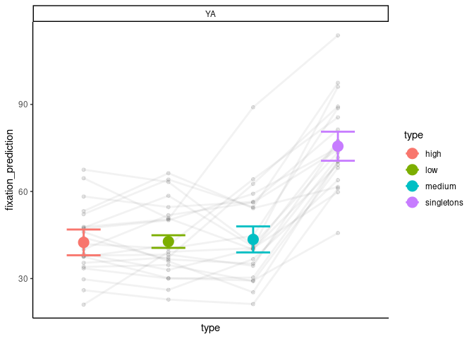
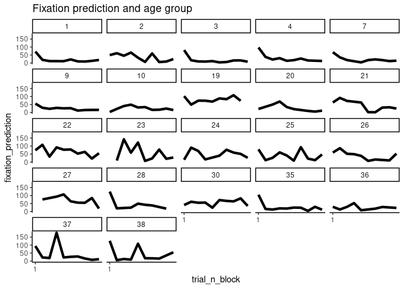
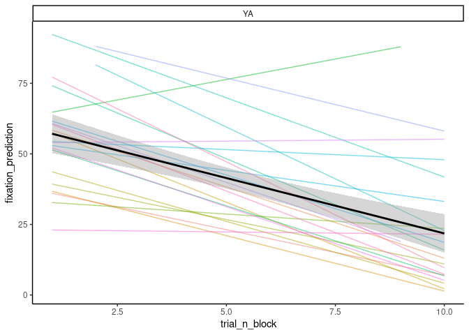
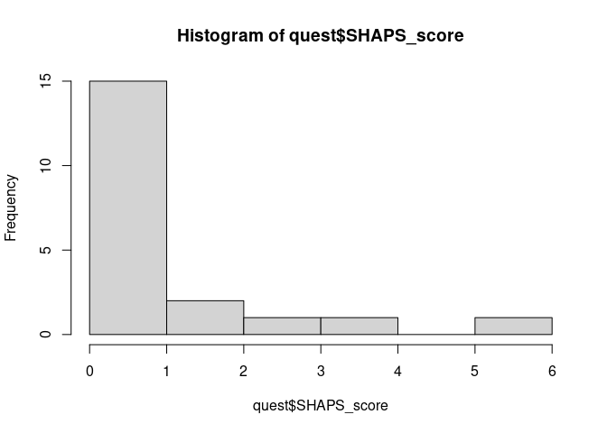
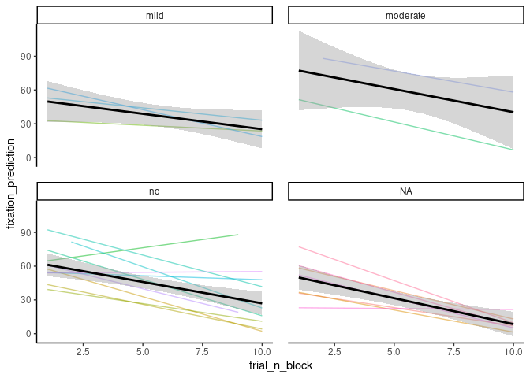
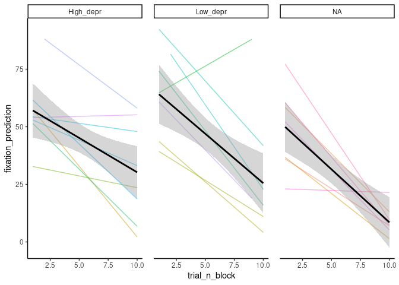

Analysis_Isabel
================
Francesco Pupillo
2023-07-05

-   [Analysis of the Data for Isabel](#analysis-of-the-data-for-isabel)
    -   [Get the data](#get-the-data)
    -   [ET data](#et-data)

# Analysis of the Data for Isabel

Source and Initialize packages and functions

## Get the data

``` r
#------------------------------------------------------------------------------#
# get the data from the two versions and merge them
#------------------------------------------------------------------------------#
ds<-list.files("data")

version1<-read.csv(paste0('data/',ds[1]))
version2<-read.csv(paste0('data/',ds[2]))

# since we have two "participants two", delete the second one
# also the number 50 (which is me)
version1<-version1[version1$participant!=50 ,]

version2<-version2[version2$participant!=02  ,]

# before merging, check the variables of interest
vars<-names(version2)[names(version2) %in% names(version1)]

# delete the first that is just a "x'
vars<-vars[-1]

# subset these variables in the two versions
version1<-version1[, vars]
version2<-version2[, vars]

# merge them 
data_all<-rbind(version1, version2)

# how many participants?
participants<-unique(data_all$participant)

# count them by age group
count<-data_all %>%
  group_by(participant, age_group) %>%
  tally()

# select only young adults
data_all<-data_all[data_all$age_group=="YA",]
```

## ET data

### prediction

``` r
#------------------------------------------------------------------------------#
# have a look at the et data- 

# select only participants for which we have the eyetracking  data
sum_et<-data_all %>%
  group_by(participant) %>%
  dplyr::summarise(et = mean(fixation_error, na.rm = T))

# which participants have the et data?
part_incl<-sum_et$participant[!is.na(sum_et$et)]
part_incl
```

    ##  [1]  1  2  3  4  7  9 10 19 20 21 22 23 24 25 26 27 28 30 35 36 37 38

``` r
# subset
all_data_et<-data_all[data_all$participant %in% part_incl,]

# plot prediction - distance between where they look at and the most likely location

# aggregated by trial type
dat_summary_fix_type<- summarySEwithin(all_data_et,
                                       measurevar = "fixation_prediction",
                                       withinvars = c("type" ), 
                                       betweenvars = "age_group",
                                       idvar = "participant", 
                                       na.rm = T)
```

    ## Automatically converting the following non-factors to factors: age_group, type

``` r
# plot
ggplot(all_data_et %>%
         group_by(participant,
                  type)%>%
         dplyr::summarise(fixation_prediction=mean(fixation_prediction, na.rm=T)), 
       aes(x = type, y = fixation_prediction, colour = type ))+
  geom_point(alpha = 0.10, colour = "black" )+
  geom_line( aes(type, fixation_prediction,group = participant),
             size=1, alpha=0.05, stat="summary" , colour = 'black')+
  theme(axis.text.x = element_blank())+ # we are showing the different levels through the colors, so we can avoid naming the bars
  geom_point(stat="summary", size = 5, data = dat_summary_fix_type)+
  
  geom_errorbar(aes( y = fixation_prediction, ymin = fixation_prediction - ci, 
                     ymax = fixation_prediction + ci),
                width = 0.40, size = 1,data=dat_summary_fix_type)+
  
  facet_wrap(.~age_group)+
  custom_param()+
  theme_classic()+
  theme(axis.text.x = element_blank(), 
        axis.ticks.x = element_blank()) 
```

    ## `summarise()` has grouped output by 'participant'. You can override using the
    ## `.groups` argument.

    ## Warning: Using `size` aesthetic for lines was deprecated in ggplot2 3.4.0.
    ## ℹ Please use `linewidth` instead.
    ## This warning is displayed once every 8 hours.
    ## Call `lifecycle::last_lifecycle_warnings()` to see where this warning was
    ## generated.

    ## No summary function supplied, defaulting to `mean_se()`

    ## No summary function supplied, defaulting to `mean_se()`

<!-- -->

### Learning for the first 10 trials, by participant

``` r
# look at learning only from the first 10 trials
# by subject
ggplot(all_data_et[all_data_et$trial_n_block<=10 & all_data_et$type!='singletons',], # we do not want the singletons
       aes(x = trial_n_block, y = fixation_prediction,
           #colour = age_group, 
           group = 1))+
  stat_summary(fun.y="mean",geom="line", size = 1.5)+
  #facet_wrap(participant~age_group)+
  facet_wrap(participant~.)+
  scale_x_continuous(breaks=seq(1, 100, 19))+
  scale_color_manual(values = c(c( "#AA4499" ,"#44AA99","#332288")))+
  theme_classic()+
  ggtitle("Fixation prediction and age group")
```

    ## Warning: The `fun.y` argument of `stat_summary()` is deprecated as of ggplot2 3.3.0.
    ## ℹ Please use the `fun` argument instead.
    ## This warning is displayed once every 8 hours.
    ## Call `lifecycle::last_lifecycle_warnings()` to see where this warning was
    ## generated.

    ## Warning: Removed 119 rows containing non-finite values (`stat_summary()`).

<!-- --> \###
Learning for the first 10 trials: across participants

``` r
ggplot(all_data_et[all_data_et$trial_n_block<=10 & all_data_et$type!='singletons',], aes( x=trial_n_block, y=fixation_prediction))+
  geom_line(stat="smooth",method = "lm", formula=y~x, alpha=0.5, se=F)+
  aes(colour = factor(participant))+
  geom_smooth(method="lm",formula=y~x, se=T, colour = "black" )+
  theme(strip.text.x = element_text(size = 13))+
  theme_classic()+
  theme(panel.spacing = unit(1, "lines"))+
  facet_wrap(.~age_group)+
  #ggtitle("Experiment 2")+
  theme(legend.position = "none")
```

    ## Warning: Removed 119 rows containing non-finite values (`stat_smooth()`).
    ## Removed 119 rows containing non-finite values (`stat_smooth()`).

<!-- -->

### Include the questionnaires

``` r
# add the questionnaires
quest<-read.csv("Questionnaires.csv", sep = ";")

# check distribution of BDI and SHAPS
hist(quest$BDI_score)
```

<!-- -->

``` r
hist(quest$SHAPS_score)
```

<!-- -->

``` r
# attache the values to each participant
# relevant variables
rel_var<-c("BDI_score", "BDI_class", "SHAPS_score", "SHAPS_class")

# initialize them in the dataframe
for (var in rel_var){
  
  all_data_et[[var]]<-NA
  
}


for ( n in 1:nrow(all_data_et)){
  
  # get the scores for current participant
  curr_part<-quest[quest$ID == all_data_et$participant[n],]
  
  # if we have questionnaires data for that participant
  if (nrow(curr_part)>0 ){
  for (var in rel_var){
    
    all_data_et[[var]][n]<-curr_part[[var]]
    
  }
  }

}
```

### Plot the questionnaires by symptom severity

``` r
ggplot(all_data_et[all_data_et$trial_n_block<=10 & all_data_et$type!='singletons',], aes( x=trial_n_block, y=fixation_prediction))+
  geom_line(stat="smooth",method = "lm", formula=y~x, alpha=0.5, se=F)+
  aes(colour = factor(participant))+
  geom_smooth(method="lm",formula=y~x, se=T, colour = "black" )+
  theme(strip.text.x = element_text(size = 13))+
  theme_classic()+
  theme(panel.spacing = unit(1, "lines"))+
  facet_wrap(.~BDI_class)+
  #ggtitle("Experiment 2")+
  theme(legend.position = "none")
```

    ## Warning: Removed 119 rows containing non-finite values (`stat_smooth()`).
    ## Removed 119 rows containing non-finite values (`stat_smooth()`).

<!-- -->

### Analyze

``` r
# -----------------------------------------------------------------------------#
# center trial_n_block
all_data_et$trial_n_block_c<-scale(all_data_et$trial_n_block, center = T)

# analyze
mod_BDI<-lmer(fixation_prediction~BDI_score*trial_n_block_c +
                (1+trial_n_block_c|participant), 
              data=all_data_et[all_data_et$trial_n_block<=10 & all_data_et$type!='singletons',])
```

    ## boundary (singular) fit: see help('isSingular')

    ## Warning: Model failed to converge with 1 negative eigenvalue: -2.9e-01

``` r
model_parameters(mod_BDI)
```

    ## Package 'merDeriv' needs to be installed to compute confidence intervals
    ##   for random effect parameters.

    ## # Fixed Effects
    ## 
    ## Parameter                   | Coefficient |    SE |            95% CI | t(340) |     p
    ## --------------------------------------------------------------------------------------
    ## (Intercept)                 |      -52.33 | 31.83 | [-114.94,  10.29] |  -1.64 | 0.101
    ## BDI score                   |        0.78 |  2.75 | [  -4.64,   6.19] |   0.28 | 0.778
    ## trial n block c             |      -67.49 | 21.97 | [-110.70, -24.28] |  -3.07 | 0.002
    ## BDI score × trial n block c |        0.64 |  1.90 | [  -3.09,   4.38] |   0.34 | 0.735
    ## 
    ## # Random Effects
    ## 
    ## Parameter                                    | Coefficient
    ## ----------------------------------------------------------
    ## SD (Intercept: participant)                  |        0.00
    ## SD (trial_n_block_c: participant)            |       10.61
    ## Cor (Intercept~trial_n_block_c: participant) |            
    ## SD (Residual)                                |       40.83

    ## 
    ## Uncertainty intervals (equal-tailed) and p-values (two-tailed) computed
    ##   using a Wald t-distribution approximation.

``` r
# alternatively, to print the table in your local pc, you can use:
model_parameters
```

    ## function (model, ...) 
    ## {
    ##     UseMethod("model_parameters")
    ## }
    ## <bytecode: 0x55b9403f19b8>
    ## <environment: namespace:parameters>

``` r
# mod shaps
mod_SHAPS<-lmer(fixation_prediction~SHAPS_score*trial_n_block_c +
                (1+trial_n_block_c|participant), 
              data=all_data_et[all_data_et$trial_n_block<=10 & all_data_et$type!='singletons',])
```

    ## boundary (singular) fit: see help('isSingular')

``` r
model_parameters(mod_SHAPS)
```

    ## Package 'merDeriv' needs to be installed to compute confidence intervals
    ##   for random effect parameters.

    ## # Fixed Effects
    ## 
    ## Parameter                     | Coefficient |    SE |           95% CI | t(340) |      p
    ## ----------------------------------------------------------------------------------------
    ## (Intercept)                   |      -48.57 | 24.84 | [-97.44,   0.30] |  -1.96 | 0.051 
    ## SHAPS score                   |        8.34 | 18.27 | [-27.59,  44.27] |   0.46 | 0.648 
    ## trial n block c               |      -60.95 | 15.57 | [-91.57, -30.33] |  -3.92 | < .001
    ## SHAPS score × trial n block c |        2.29 | 11.67 | [-20.66,  25.24] |   0.20 | 0.844 
    ## 
    ## # Random Effects
    ## 
    ## Parameter                                    | Coefficient
    ## ----------------------------------------------------------
    ## SD (Intercept: participant)                  |       35.98
    ## SD (trial_n_block_c: participant)            |       14.46
    ## Cor (Intercept~trial_n_block_c: participant) |        1.00
    ## SD (Residual)                                |       40.63

    ## 
    ## Uncertainty intervals (equal-tailed) and p-values (two-tailed) computed
    ##   using a Wald t-distribution approximation.

``` r
# categorical
mod_BIDS_class<-lmer(fixation_prediction~BDI_class*trial_n_block_c +
                  (1|participant), 
                data=all_data_et[all_data_et$trial_n_block<=10 & all_data_et$type!='singletons',])

model_parameters(mod_BIDS_class)
```

    ## Package 'merDeriv' needs to be installed to compute confidence intervals
    ##   for random effect parameters.

    ## # Fixed Effects
    ## 
    ## Parameter                              | Coefficient |    SE |            95% CI | t(340) |     p
    ## -------------------------------------------------------------------------------------------------
    ## (Intercept)                            |      -31.11 | 42.93 | [-115.56,  53.33] |  -0.72 | 0.469
    ## BDI class [moderate]                   |      -16.95 | 81.02 | [-176.33, 142.42] |  -0.21 | 0.834
    ## BDI class [no]                         |      -15.71 | 48.69 | [-111.49,  80.07] |  -0.32 | 0.747
    ## trial n block c                        |      -46.40 | 28.52 | [-102.49,   9.69] |  -1.63 | 0.105
    ## BDI class [moderate] × trial n block c |      -22.96 | 54.26 | [-129.68,  83.77] |  -0.42 | 0.673
    ## BDI class [no] × trial n block c       |      -16.75 | 32.27 | [ -80.23,  46.73] |  -0.52 | 0.604
    ## 
    ## # Random Effects
    ## 
    ## Parameter                   | Coefficient
    ## -----------------------------------------
    ## SD (Intercept: participant) |       16.00
    ## SD (Residual)               |       40.75

    ## 
    ## Uncertainty intervals (equal-tailed) and p-values (two-tailed) computed
    ##   using a Wald t-distribution approximation.

``` r
(anova(mod_BIDS_class))
```

    ## Type III Analysis of Variance Table with Satterthwaite's method
    ##                            Sum Sq Mean Sq NumDF  DenDF F value   Pr(>F)   
    ## BDI_class                   180.1    90.1     2 339.88  0.0542 0.947219   
    ## trial_n_block_c           16755.3 16755.3     1 330.12 10.0888 0.001633 **
    ## BDI_class:trial_n_block_c   517.4   258.7     2 330.20  0.1558 0.855807   
    ## ---
    ## Signif. codes:  0 '***' 0.001 '**' 0.01 '*' 0.05 '.' 0.1 ' ' 1

``` r
mod_SHAPS_class<-lmer(fixation_prediction~SHAPS_class*trial_n_block_c +
                       (1|participant), 
                     data=all_data_et[all_data_et$trial_n_block<=10 & all_data_et$type!='singletons',])

model_parameters(mod_SHAPS_class)
```

    ## Package 'merDeriv' needs to be installed to compute confidence intervals
    ##   for random effect parameters.

    ## # Fixed Effects
    ## 
    ## Parameter                          | Coefficient |    SE |            95% CI | t(342) |     p
    ## ---------------------------------------------------------------------------------------------
    ## (Intercept)                        |      -59.98 | 49.48 | [-157.30,  37.34] |  -1.21 | 0.226
    ## SHAPS class [no]                   |       19.20 | 53.78 | [ -86.58, 124.98] |   0.36 | 0.721
    ## trial n block c                    |      -74.14 | 33.07 | [-139.19,  -9.10] |  -2.24 | 0.026
    ## SHAPS class [no] × trial n block c |       16.23 | 35.87 | [ -54.32,  86.78] |   0.45 | 0.651
    ## 
    ## # Random Effects
    ## 
    ## Parameter                   | Coefficient
    ## -----------------------------------------
    ## SD (Intercept: participant) |       15.95
    ## SD (Residual)               |       40.69

    ## 
    ## Uncertainty intervals (equal-tailed) and p-values (two-tailed) computed
    ##   using a Wald t-distribution approximation.

``` r
anova(mod_SHAPS_class)
```

    ## Type III Analysis of Variance Table with Satterthwaite's method
    ##                             Sum Sq Mean Sq NumDF  DenDF F value    Pr(>F)    
    ## SHAPS_class                    211     211     1 343.04  0.1274 0.7213199    
    ## trial_n_block_c              22446   22446     1 331.22 13.5547 0.0002705 ***
    ## SHAPS_class:trial_n_block_c    339     339     1 331.22  0.2047 0.6512385    
    ## ---
    ## Signif. codes:  0 '***' 0.001 '**' 0.01 '*' 0.05 '.' 0.1 ' ' 1

### Median Split

``` r
# get the median of the BDI
BDI_median<-median(quest$BDI_score)

# assign participant to low depressive sympt or high depress sympt
quest$BDI_split<-ifelse(quest$BDI_score < BDI_median, "Low_depr", "High_depr" )

# check distr
table(quest$BDI_split)
```

    ## 
    ## High_depr  Low_depr 
    ##        11         9

``` r
# assign it to the dataset
all_data_et$BDI_split<-NA

for (n in 1: nrow(all_data_et)){
  if (any(quest$ID==all_data_et$participant[n])){
  all_data_et$BDI_split[n]<-quest$BDI_split[quest$ID==all_data_et$participant[n]]
  }
}

# plot
ggplot(all_data_et[all_data_et$trial_n_block<=10,], aes( x=trial_n_block, y=fixation_prediction))+
  geom_line(stat="smooth",method = "lm", formula=y~x, alpha=0.5, se=F)+
  aes(colour = factor(participant))+
  geom_smooth(method="lm",formula=y~x, se=T, colour = "black" )+
  theme(strip.text.x = element_text(size = 13))+
  theme_classic()+
  theme(panel.spacing = unit(1, "lines"))+
  facet_wrap(.~BDI_split)+
  #ggtitle("Experiment 2")+
  theme(legend.position = "none")
```

    ## Warning: Removed 119 rows containing non-finite values (`stat_smooth()`).
    ## Removed 119 rows containing non-finite values (`stat_smooth()`).

<!-- -->

``` r
# analyze
mod_median_split<-lmer(fixation_prediction~BDI_split*trial_n_block +
                       (1+trial_n_block|participant), 
                     data=all_data_et[all_data_et$trial_n_block<=10,])
```

    ## boundary (singular) fit: see help('isSingular')

``` r
summary(mod_median_split)
```

    ## Linear mixed model fit by REML. t-tests use Satterthwaite's method [
    ## lmerModLmerTest]
    ## Formula: 
    ## fixation_prediction ~ BDI_split * trial_n_block + (1 + trial_n_block |  
    ##     participant)
    ##    Data: all_data_et[all_data_et$trial_n_block <= 10, ]
    ## 
    ## REML criterion at convergence: 3569
    ## 
    ## Scaled residuals: 
    ##     Min      1Q  Median      3Q     Max 
    ## -1.6887 -0.7247 -0.1988  0.4548  2.9640 
    ## 
    ## Random effects:
    ##  Groups      Name          Variance  Std.Dev. Corr
    ##  participant (Intercept)    128.8783 11.3525      
    ##              trial_n_block    0.7541  0.8684  1.00
    ##  Residual                  1647.3799 40.5879      
    ## Number of obs: 348, groups:  participant, 15
    ## 
    ## Fixed effects:
    ##                                 Estimate Std. Error     df t value Pr(>|t|)    
    ## (Intercept)                       60.512      7.831 23.588   7.728 6.52e-08 ***
    ## BDI_splitLow_depr                  8.658     11.258 22.241   0.769  0.44993    
    ## trial_n_block                     -2.999      1.108 59.455  -2.707  0.00884 ** 
    ## BDI_splitLow_depr:trial_n_block   -1.099      1.605 57.086  -0.685  0.49614    
    ## ---
    ## Signif. codes:  0 '***' 0.001 '**' 0.01 '*' 0.05 '.' 0.1 ' ' 1
    ## 
    ## Correlation of Fixed Effects:
    ##             (Intr) BDI_sL_ trl_n_
    ## BDI_spltLw_ -0.696               
    ## tril_n_blck -0.589  0.410        
    ## BDI_spL_:__  0.407 -0.579  -0.690
    ## optimizer (nloptwrap) convergence code: 0 (OK)
    ## boundary (singular) fit: see help('isSingular')

``` r
model_parameters(mod_median_split)
```

    ## Package 'merDeriv' needs to be installed to compute confidence intervals
    ##   for random effect parameters.

    ## # Fixed Effects
    ## 
    ## Parameter                            | Coefficient |    SE |          95% CI | t(340) |      p
    ## ----------------------------------------------------------------------------------------------
    ## (Intercept)                          |       60.51 |  7.83 | [ 45.11, 75.91] |   7.73 | < .001
    ## BDI split [Low_depr]                 |        8.66 | 11.26 | [-13.49, 30.80] |   0.77 | 0.442 
    ## trial n block                        |       -3.00 |  1.11 | [ -5.18, -0.82] |  -2.71 | 0.007 
    ## BDI split [Low_depr] × trial n block |       -1.10 |  1.61 | [ -4.26,  2.06] |  -0.68 | 0.494 
    ## 
    ## # Random Effects
    ## 
    ## Parameter                                  | Coefficient
    ## --------------------------------------------------------
    ## SD (Intercept: participant)                |       11.35
    ## SD (trial_n_block: participant)            |        0.87
    ## Cor (Intercept~trial_n_block: participant) |        1.00
    ## SD (Residual)                              |       40.59

    ## 
    ## Uncertainty intervals (equal-tailed) and p-values (two-tailed) computed
    ##   using a Wald t-distribution approximation.

``` r
# print the long dataset for the first 10 trials
write.csv(all_data_et[all_data_et$trial_n_block<=10,], "output_files/et_data_first10.csv", row.names =F)

# extract coefficients
rand_eff<-ranef(mod_median_split)

# trialNestrimates
coeff<-rand_eff$participant$trial_n_block_c

# part id
ID<-unique(all_data_et$participant[!is.na(all_data_et$BDI_split)])

# create the aggregated dataset
aggr_data<-as.data.frame(cbind(ID, coeff))

# add BDI_split
aggr_data$BDI_split<-NA

for (n in 1: nrow(aggr_data)){
  aggr_data$BDI_split[n]<-quest$BDI_split[quest$ID==aggr_data$ID[n]]
}
```
